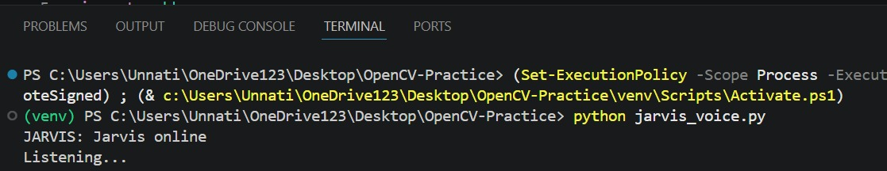
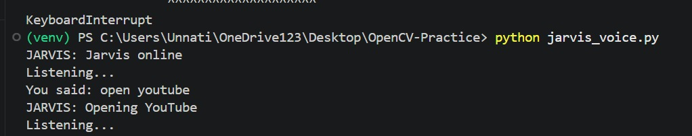

# 🤖 Jarvis AI Assistant

Jarvis AI Assistant is a Python-based voice-controlled virtual assistant that can listen to user commands, respond through speech, and perform various automated tasks. The project demonstrates the integration of speech recognition, text-to-speech technology, and automation to create an interactive desktop assistant.

## 🚀 Features

- Voice Command Recognition
- Text-to-Speech Responses
- Interactive User Communication
- Hands-Free Operation
- Real-Time Command Processing
- Simple and User-Friendly Interface

## 🛠️ Technologies Used

- Python
- SpeechRecognition
- Pyttsx3
- PyAudio
- OpenCV (if applicable)

## 📂 Project Structure

```text
Jarvis-AI-Assistant/
│
├── jarvis_voice.py
├── README.md
├── listening.png
└── response.png
```

## 📸 Screenshots

### Jarvis Listening


### Jarvis Response


## 🎯 Learning Outcomes

Through this project, I gained practical experience in:

- Voice Recognition Systems
- Python Automation
- Speech Processing
- User Interaction Design
- Project Development and Organization

## 🔮 Future Improvements

- AI-Powered Conversations
- Weather Information Integration
- Email Automation
- Application Control
- Smart Home Integration
- Face Recognition Support

## 👩‍💻 Developer

**Unnati**

Final Year Student | AI & Software Development Enthusiast

GitHub: https://github.com/unnaticreates

## ⭐ Project Goal

The goal of this project is to explore voice-based human-computer interaction and build a foundation for more advanced AI assistant systems.
